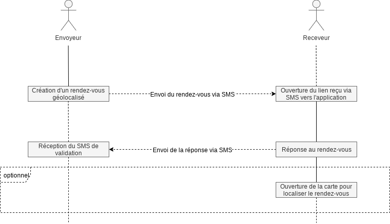

# Projet Android : Prise de rendez-vous géolocalisé

## Description

Le projet a pour but le développement d’une application permettant d’organiser des rendez-vous géolocalisés.

Le fonctionnement de l'application est le suivant :

